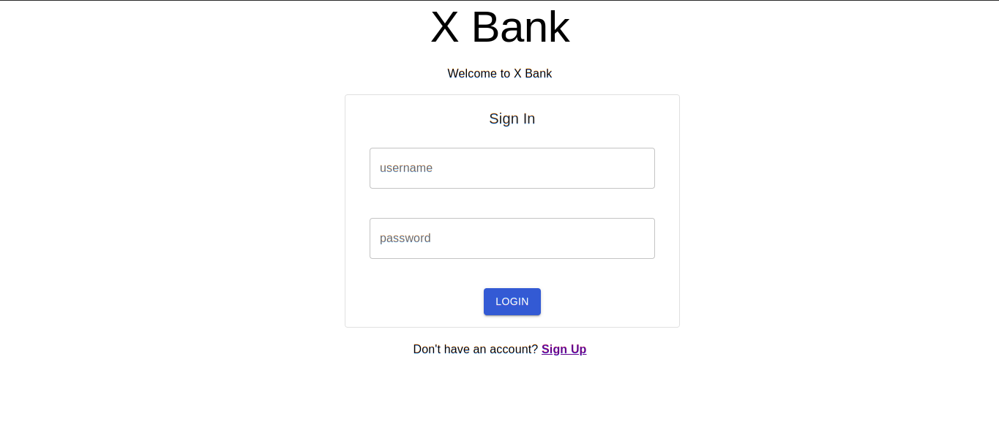
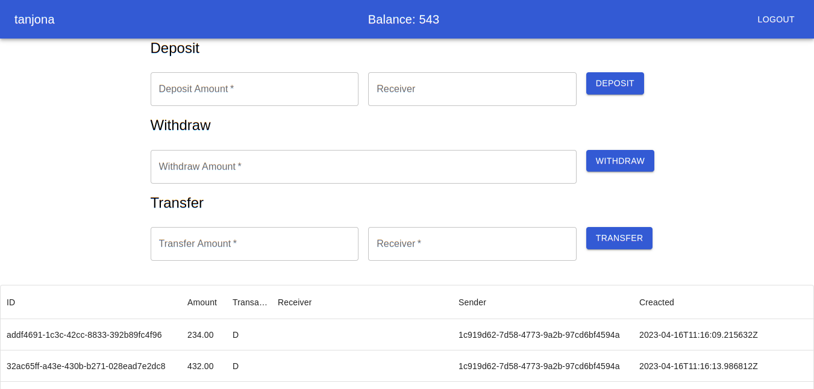

# Banking Application - Built with Django Rest Framework
This project is a simple Banking API built with Django Rest Framework (server) and React js (client).

# Installation Steps (Linux)
To get started, clone the repository by running the following command in your terminal:

```
git clone git@github.com:NirinaTanjona/banking-app.git
```

Move to the project repository with:

```
cd banking-app
```

Some environment variables are needed to make the app run, so copy the env.template to .env:

```
cp env.template .env
```

Build the Docker image:

```
sudo docker-compose up -d --build
```

If everything worked correctly, you should be able to launch the app with:

```
sudo docker-compose up
```

You're done with the backend installation! Now let's install the UI.

You are now inside the banking-app directory.

Move to the UI folder by running:

```
cd ui
```

Copy some environment variables:

```
cp .env.development.local.sample .env.development.local
```

Install all required dependencies by running:

```
npm install
```

Alternatively, you can use Yarn:

```
yarn install
```

To run the app, execute the following command:

```
yarn start
```

Or, if you prefer using npm:

```
npm start
```

You should now be able to use the application.

# Exemple of the running app





To create a user admin (superuser)

go To the root of the app and run this command

```
sudo docker ps --format "{{.ID}} {{.Names}}"
```
this should return name of the project followed by `_api_1`

```
sudo docker exec -it <container_name_api_1> python manage.py createsuperuser
```

NOTE: This command will work only if the server is running.
